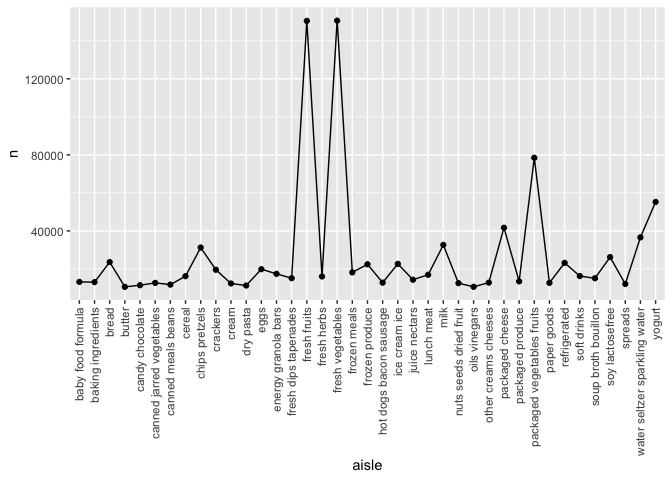

p8105_hw3_yx2858
================
Yueyi Xu
2023-10-08

``` r
library(p8105.datasets)
library(tidyverse)
library(dplyr)
```

# Problem 1

### Question 1

#### Question1_1

How many aisles are there, and which aisles are the most items ordered
from?

``` r
data("instacart") #import the data instacart
question1_1 <- instacart %>% #assign the variable
  count(aisle) %>% #count the number of aisle
  arrange(desc(n)) #arrange the aisle in descending order
```

There are 134 aisles, and fresh vegetables are the most items ordered
from.

#### Question1_2

Make a plot that shows the number of items ordered in each aisle,
limiting this to aisles with more than 10000 items ordered. Arrange
aisles sensibly, and organize your plot so others can read it.

``` r
question1_2 <- question1_1 %>% #assign the variable
  filter(n > 10000) %>% #filter the aisles with more than 10000 items ordered
  arrange(desc(n)) #arrange in descending order
ggplot(data = question1_2, aes(x = aisle, y = n, group = 1)) + #graph the plot
  geom_line() + #add the line
  geom_point() + #add the point
  theme(axis.text.x = element_text(angle = 90, vjust = 0.5, hjust = 1)) #reverse the names of x axis to horizontal view
```

<!-- -->
There are 39 aisles with more than 10000 items ordered.
