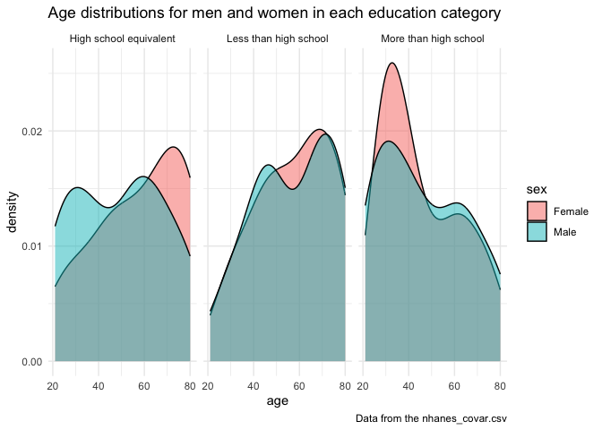
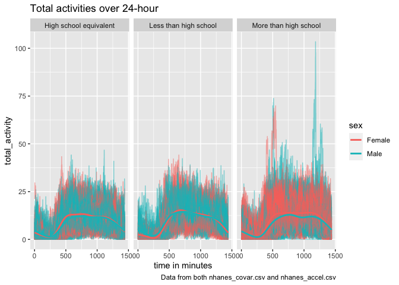

p8105_hw3_yx2858
================
Yueyi Xu
2023-10-08

``` r
library(p8105.datasets)
library(tidyverse)
library(dplyr)
```

# Problem 1

#### Question1_1

How many aisles are there, and which aisles are the most items ordered
from?

``` r
data("instacart") #import the data instacart
instacart = instacart |> #assign the variable
  as_tibble()
```

``` r
instacart |>
  count(aisle) |> #count the number of aisle
  arrange(desc(n)) #arrange the aisle in descending order
```

    ## # A tibble: 134 × 2
    ##    aisle                              n
    ##    <chr>                          <int>
    ##  1 fresh vegetables              150609
    ##  2 fresh fruits                  150473
    ##  3 packaged vegetables fruits     78493
    ##  4 yogurt                         55240
    ##  5 packaged cheese                41699
    ##  6 water seltzer sparkling water  36617
    ##  7 milk                           32644
    ##  8 chips pretzels                 31269
    ##  9 soy lactosefree                26240
    ## 10 bread                          23635
    ## # ℹ 124 more rows

There are 134 aisles, and fresh vegetables are the most items ordered
from.

#### Question1_2

Make a plot that shows the number of items ordered in each aisle,
limiting this to aisles with more than 10000 items ordered. Arrange
aisles sensibly, and organize your plot so others can read it.

``` r
instacart |> 
  count(aisle) |> 
  filter(n > 10000) |> #filter the aisles with more than 10000 items ordered
  mutate(aisle = fct_reorder(aisle, n)) |> 
  ggplot(aes(x = aisle, y = n)) + 
  geom_point() + 
  labs(title = "Number of items ordered in each aisle") +
  theme(axis.text.x = element_text(angle = 60, hjust = 1)) #reverse the names of x axis to horizontal view
```

<!-- -->
There are 39 aisles with more than 10000 items ordered.

#### Question1_3

Make a table showing the three most popular items in each of the aisles
“baking ingredients”, “dog food care”, and “packaged vegetables fruits”.
Include the number of times each item is ordered in your table.

``` r
instacart |> 
  filter(aisle %in% c("baking ingredients", "dog food care", "packaged vegetables fruits")) |> #filter the dataset into only these three values
  group_by(aisle) |> #group the filtered dataset
  count(product_name) |> #count the number of each products
  mutate(rank = min_rank(desc(n))) |> 
  filter(rank < 4) |> #select the top 3 products with the highest count
  arrange(desc(n)) |>
  knitr::kable()
```

| aisle                      | product_name                                  |    n | rank |
|:---------------------------|:----------------------------------------------|-----:|-----:|
| packaged vegetables fruits | Organic Baby Spinach                          | 9784 |    1 |
| packaged vegetables fruits | Organic Raspberries                           | 5546 |    2 |
| packaged vegetables fruits | Organic Blueberries                           | 4966 |    3 |
| baking ingredients         | Light Brown Sugar                             |  499 |    1 |
| baking ingredients         | Pure Baking Soda                              |  387 |    2 |
| baking ingredients         | Cane Sugar                                    |  336 |    3 |
| dog food care              | Snack Sticks Chicken & Rice Recipe Dog Treats |   30 |    1 |
| dog food care              | Organix Chicken & Brown Rice Recipe           |   28 |    2 |
| dog food care              | Small Dog Biscuits                            |   26 |    3 |

#### Question1_4

Make a table showing the mean hour of the day at which Pink Lady Apples
and Coffee Ice Cream are ordered on each day of the week; format this
table for human readers (i.e. produce a 2 x 7 table).

``` r
instacart |>
  filter(product_name %in% c("Pink Lady Apples", "Coffee Ice Cream")) |> #filter the dataset into which "product_name" is either "Pink Lady Apples" or "Coffee Ice Cream"
  group_by(product_name, order_dow) |> #group the filtered dataset for each combination of product and day of the week
  summarize(mean_hour = mean(order_hour_of_day)) |> #calculate the mean hour of the day when orders for each product were placed, ignore the ones with missing value
  pivot_wider( #pivot the summarized dataset into each day of the week as a separate column with the mean order hour; therefore, this table becomes a 2x7 table (2 product_name, and 7 days of the week)
    names_from = order_dow, 
    values_from = mean_hour) |>
  knitr::kable(digits = 2)
```

    ## `summarise()` has grouped output by 'product_name'. You can override using the
    ## `.groups` argument.

| product_name     |     0 |     1 |     2 |     3 |     4 |     5 |     6 |
|:-----------------|------:|------:|------:|------:|------:|------:|------:|
| Coffee Ice Cream | 13.77 | 14.32 | 15.38 | 15.32 | 15.22 | 12.26 | 13.83 |
| Pink Lady Apples | 13.44 | 11.36 | 11.70 | 14.25 | 11.55 | 12.78 | 11.94 |

# Problem 2

``` r
data("brfss_smart2010")
```

#### Question2_1

Data Cleaning:

``` r
brfss_clean_df = 
  brfss_smart2010 |>
  janitor::clean_names() |>
  filter(topic == "Overall Health") |> #filter the dataset to include only "Overall Health"
  filter(response == "Excellent" | response == "Very good" | response == "Good" | response == "Fair" | response == "Poor") |>
  mutate(response = as.factor(response), 
         response = ordered(response, levels = c("Excellent", "Very good", "Good", "Fair", "Poor"))) #modify the "Response" variable by converting it 
```

#### Question2_2

In 2002, which states were observed at 7 or more locations? What about
in 2010?

``` r
question2_2_2002 =
  filter(brfss_clean_df, year == 2002) |> #filter the dataset to include only data for the year 2002
  group_by(locationabbr) |> #group the dataset by the "locationabbr" variable which represents the state
  summarize(count_locationdistinct = n_distinct(locationdesc)) |> #in each state group, calculate the number of distinct "locationdesc" values and add up together
  filter(count_locationdistinct >= 7) #filter the result to include only states where the count of distinct "locationdesc" values is greater or equal to 7
locationabbr_2002 = #extract "locationabbr" column from the "locationabbr_2002" dataset
  pull(question2_2_2002, locationabbr)

question2_2_2010 =
  filter(brfss_clean_df, year == 2010) |> #filter the dataset to include only data for the year 2002
  group_by(locationabbr) |> #group the dataset by the "locationabbr" variable which represents the state
  summarize(count_locationdistinct = n_distinct(locationdesc)) |> #in each state group, calculate the number of distinct "locationdesc" values and add up together
  filter(count_locationdistinct >= 7) #filter the result to include only states where the count of distinct "locationdesc" values is greater or equal to 7
locationabbr_2010 = #extract "locationabbr" column from the "locationabbr_2010" dataset
  pull(question2_2_2010, locationabbr)
```

In 2002, CT, FL, MA, NC, NJ, PA were observed at 7 or more locations. In
2010, CA, CO, FL, MA, MD, NC, NE, NJ, NY, OH, PA, SC, TX, WA were
observed at 7 or more locations.

#### Question2_3

Construct a dataset that is limited to Excellent responses, and
contains, year, state, and a variable that averages the data_value
across locations within a state. Make a “spaghetti” plot of this average
value over time within a state (that is, make a plot showing a line for
each state across years – the geom_line geometry and group aesthetic
will help).

``` r
question2_3_excellent =
  brfss_clean_df |>
  filter(response == "Excellent") |> #filter and limit to only excellent response
  group_by(year, locationabbr) |> #group the dataset of "year" and "locationabbr"
  summarize(average_data = mean(data_value, na.rm = TRUE)) #calculate the mean of "data_value" for each of "year" and "locationabbr", ignore the ones with missing value
```

    ## `summarise()` has grouped output by 'year'. You can override using the
    ## `.groups` argument.

``` r
question2_3_excellent |>
  ggplot(aes(x = year, y = average_data, color = locationabbr)) +
  geom_path() +
  labs( #set up the dataset of "question2_3_excellent" and map the x axis as the "Year" variable and y axis as the "Average_value" variable
    title = "Average value over time within a state",
    x = "Year",
    y = "Average value",
    caption = "Data from the p8105.datasets"
  ) +
  theme_minimal() #apply the minimalistic theme to the plot, result in a clean and minimal appearance
```

<!-- -->

#### Question2_4

Make a two-panel plot showing, for the years 2006, and 2010,
distribution of data_value for responses (“Poor” to “Excellent”) among
locations in NY State.

``` r
question2_4_2006_2010 = 
  brfss_clean_df |>
  filter(locationabbr == "NY") |> #filter and limit to only "NY" state
  filter(year == 2006 | year == 2010) |> #filter to only years 2006 and 2010
  select(year, locationabbr, locationdesc, response, data_value) |> #select the specific columns from the filtered data
  group_by(year, locationabbr) #group the data by "year" and "locationabbr"

question2_4_2006_2010 |>
  ggplot(aes(x = response, y = data_value)) + #specify the ggplot object with x axis of response and y axis of data_value
  geom_boxplot() + #add boxplot to the plot
  facet_wrap(~ year, ncol = 2) + #split the plot into smaller subplots based on the "year" variable and arrange them in 2 columns; create separate boxplots for 2006 and 2010
  labs( #set the boxplot's title, x axis label, y axis label, and caption
    title = "Distribution of data_value for responses among locations in NY State in 2006 and 2010",
    x = "Year",
    y = "Distribution of Data_value",
    caption = "Data from the p8105.datasets"
  )
```

<!-- -->

# Problem 3

Clean, organize the nhanes_covar dataset:

``` r
covar_clean_df =
  read_csv("nhanes_covar.csv", skip = 4) |> #import the data to dataframe
  janitor::clean_names() |> #clean the names
  filter(age >= 21) |> #filter the data to include only age larger than 21
  mutate(
    sex = replace(sex, sex == 1, "Male"),
    sex = replace(sex, sex == 2, "Female"),
    education = replace(education, education == 1, "Less than high school"),
    education = replace(education, education == 2, "High school equivalent"),
    education = replace(education, education == 3, "More than high school")
  ) |> #replace the values in sex and education columns
  mutate(sex = as.factor(sex),
         education = as.factor(education)) |> #convert the sex and education columns to factor variables
  na.omit() #remove rows with missing values from the dataset
```

    ## Rows: 250 Columns: 5
    ## ── Column specification ────────────────────────────────────────────────────────
    ## Delimiter: ","
    ## dbl (5): SEQN, sex, age, BMI, education
    ## 
    ## ℹ Use `spec()` to retrieve the full column specification for this data.
    ## ℹ Specify the column types or set `show_col_types = FALSE` to quiet this message.

Clean, organize the nhanes_accel dataset:

``` r
accel_clean_df =
  read_csv("nhanes_accel.csv") |> #import the data to dataframe
  janitor::clean_names() |> #clean the names
  pivot_longer(
    min1:min1440, #specify the range of columns to pivot 
    names_to = "minutes", #rename the columns of "minutes" to represent time of minutes
    values_to = "val_min", #rename the columns of "val_min" to represent values of minutes
    names_prefix = "min" #remove the "min" in front of all column names
  ) |>
  mutate(minutes = as.numeric(minutes)) #change the variable minutes from characters to numerics
```

    ## Rows: 250 Columns: 1441
    ## ── Column specification ────────────────────────────────────────────────────────
    ## Delimiter: ","
    ## dbl (1441): SEQN, min1, min2, min3, min4, min5, min6, min7, min8, min9, min1...
    ## 
    ## ℹ Use `spec()` to retrieve the full column specification for this data.
    ## ℹ Specify the column types or set `show_col_types = FALSE` to quiet this message.

Combine two dataframes:

``` r
combine_covar_accel = #create a combined dataframe
  left_join(covar_clean_df, accel_clean_df, by = "seqn") #left_join combine two dataframes based on the common column "seqn"
```

#### Question3_1

Produce a reader-friendly table for the number of men and women in each
education category, and create a visualization of the age distributions
for men and women in each education category. Comment on these items.

Table:

``` r
sex_education = 
  select(covar_clean_df, sex | education) #select only sex and education columns from the dataframe
table(sex_education) #generate a table containing the numbers of sex and education columns only
```

    ##         education
    ## sex      High school equivalent Less than high school More than high school
    ##   Female                     23                    28                    59
    ##   Male                       35                    27                    56

Comment on table: The table displays the distribution of individuals
across various categories, including two groups based on ‘sex’ and three
groups based on different levels of ‘education’. It offers an overview
of the counts for each combination of these two variables, facilitating
a swift comparison of the frequencies of males and females within
different educational categories.

Visualization:

``` r
covar_clean_df |>
  ggplot(aes(x = age, fill = sex)) + #set up the ggplot and specify the x axis as age and fill aesthetic is mapped to the sex variable (i.e. men and women)
  geom_density(alpha = .5) + #add a density plot
  facet_grid(. ~ education) + #create separate panels for different levels of "education"
  labs( #set the plot's title, x axis label, y axis label, and caption
    title = "Age distributions for men and women in each education category",
    x = "age",
    y = "density",
    caption = "Data from the nhanes_covar.csv"
  ) +
  theme_minimal()
```

<!-- -->

Comment on visualization: The plot displays the density distributions of
age for both men and women within different education categories: “High
school equivalent,” “Less than high school,” and “More than high school.
By arranging the data into separate panels based on education levels, it
allows for clear comparisons of age distributions across these groups.
The overlapping density plots provides disparities or similarities in
age distributions between genders within each educational category. The
utilization of a minimal theme enhances the focus to the distributions,
providing a clear and concise data representation.

#### Question3_2

Traditional analyses of accelerometer data focus on the total activity
over the day. Using your tidied dataset, aggregate across minutes to
create a total activity variable for each participant. Plot these total
activities (y-axis) against age (x-axis); your plot should compare men
to women and have separate panels for each education level. Include a
trend line or a smooth to illustrate differences. Comment on your plot.

``` r
accel_tidied_df =
  combine_covar_accel |> #load the combined dataframe
  group_by(seqn, sex, age, education) |> #group by particular columns
  summarize(total_activity = sum(val_min)) #calculate the sum of counts
```

    ## `summarise()` has grouped output by 'seqn', 'sex', 'age'. You can override
    ## using the `.groups` argument.

``` r
accel_tidied_df |>
  ggplot(aes(x = age, y = total_activity, color = sex)) + #set up the ggplot and specify x axis as age and y axis as total_activity, and sex as the grouping variable for colors
  geom_point() + #add individual data to the plot
  geom_smooth(se = FALSE) + #add a smooth line to the scatterplot
  facet_grid(. ~ education) + #create separate 3 panels for different levels of "educatoin"
  labs( #set the plot's title, x axis label, y axis label, and caption
    title = "Total activities against age",
    x = "age",
    y = "total_activity",
    caption = "Data from both nhanes_covar.csv and nhanes_accel.csv"
  )
```

    ## `geom_smooth()` using method = 'loess' and formula = 'y ~ x'

<!-- -->

Comment on the plot: The plot effectively illustrates the relationship
between total activities and age across different education level
groups. It is presented in three panels, categorized by education
levels: “High school equivalent,” “Less than high school,” and “More
than high school”. The “geom_smooth” function adds a smooth line to each
scatter plot in the panels, highlighting the non-linear relationship
between age and total activities. Within the “High school equivalent”
and “More than high school” groups, women tend to exhibit higher total
activities compared to men. Conversely, in the “Less than high school”
group, women demonstrate greater total activities than men before the
age of 40, after which men exhibit higher total activities. Across all
three groups, both women and men display a gradual reduction in total
activities as age increases.

#### Question3_3

Accelerometer data allows the inspection activity over the course of the
day. Make a three-panel plot that shows the 24-hour activity time
courses for each education level and use color to indicate sex. Describe
in words any patterns or conclusions you can make based on this graph;
including smooth trends may help identify differences.

``` r
combine_covar_accel |>
  ggplot(aes(x = minutes, y = val_min, group = seqn, color = sex)) + #set up the ggplot and specify x axis as minutes and y axis val_min, group by seqn, and sex as the grouping variable for colors
  geom_line(alpha = .5) + #add a line to the plot with .5 alpha value of transparency
  facet_grid(. ~ education) + #create three separate panels for different levels of education groups
  geom_smooth(aes(group = sex), se = FALSE) + #add a smooth line for each sex
  labs( #set the plot's title, x axis label, y axis label, and caption
    title = "Total activities over 24-hour",
    x = "time in minutes",
    y = "total_activity",
    caption = "Data from both nhanes_covar.csv and nhanes_accel.csv"
  )
```

    ## `geom_smooth()` using method = 'gam' and formula = 'y ~ s(x, bs = "cs")'

<!-- -->

Comment on plot: The graph illustrates variations in total activities
throughout a 24-hour cycle, demonstrating how these activities progress
over time. Females are depicted in red, while males are represented by
the color blue, facilitating a straightforward comparison between the
trends for each sex. Observing the distinct education groups, it becomes
evident that within the “High school equivalent” and “Less than high
school” groups, men exhibit higher total activities than women over the
24-hour period. However, in the “More than high school” group, women
display greater total activities compared to men throughout the same
period.
